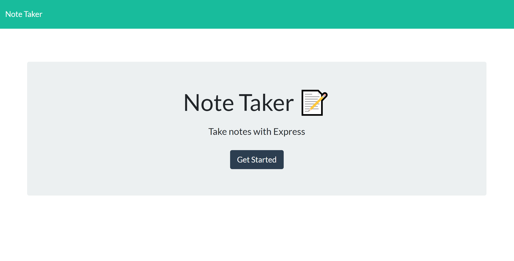
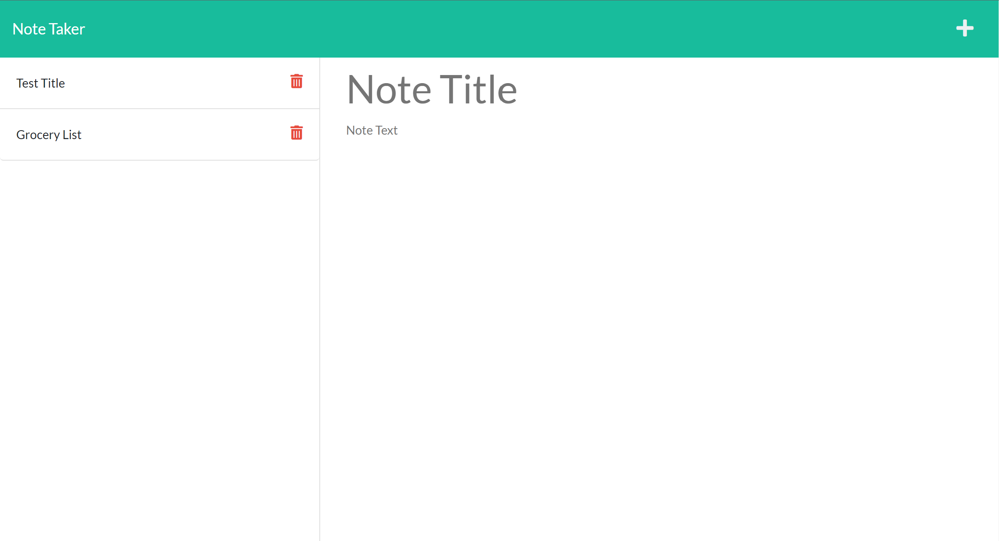
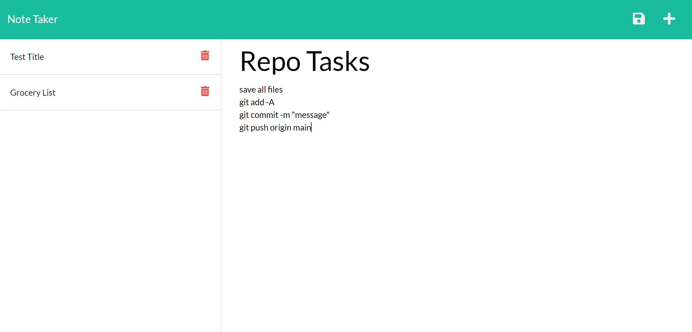

# note-taker

## Description

This assignment was my first foray into using express and working with my own server.

This application serves as a note taker. The user has the opportunity to revisit previously entered notes as well as add additional notes through an intuitive interface. 

Because this is a full stack application, the notes are not reliant on local storage.

This project furthered my understanding of the interaction between api get/post requests and fetch requests. It was a challenging task. I learned the importance of deploying early to heroku to avoid deployment errors. 

The deployed version of the application can be found at:
https://note-taker-els-2021.herokuapp.com/

## Table of Contents 
1. [Installation](#installation)
2. [Usage](#usage)
3. [Questions](#questions)

## Installation

In order to install this product, you need to:
Before running node index.js, the user must first type npm install. 

## Usage 

To use this note taker, the user clicks into the notes page through the button on the home page. 

On the lefthand side of the notes page, you are able to view and select previously created notes to view their contents. 

To add a new note, click on the plus button in the top right corner of the screen. After adding a title and content, clicking the save button adds the new note to the list on the left. 

## Questions

If you have any questions about this application, my github profile is https://github.com/ericaleesnyder, and you can email me at ericaleesnyder@gmail.com. 